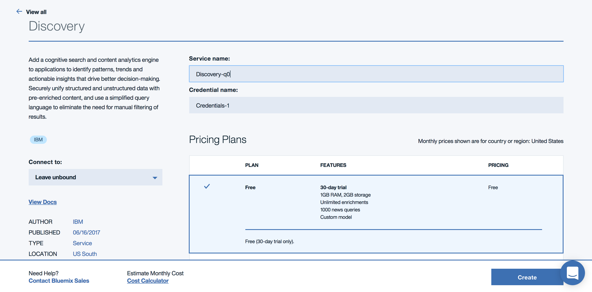
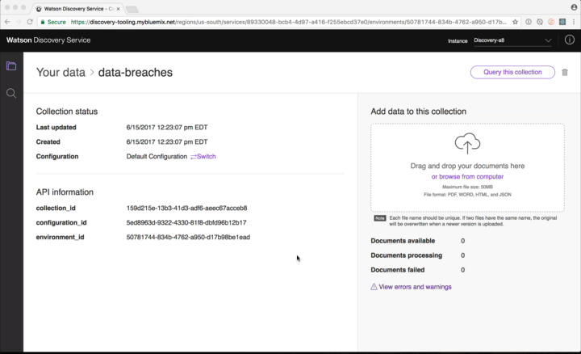

# Discovery Demo [](https://travis-ci.org/nelstrom/discovery-nodejs)

[](https://bluemix.net/deploy?repository=https://github.com/nelstrom/discovery-nodejs&branch=byod)

In this developer journey you will upload your own data into the Watson Discovery Service. Then you'll configure a web application so that it can query the data collection you created. The web app allows you to explore that data.

Once you are done with this journey you will know how to:

1. Built and run an API server with a HTML frontend written in React
1. Configure Watson Discovery Service with the App
1. Deploy the app to IBM Bluemix using cloudfoundry CLI tool

# Repo Contents

This repo contains code for:

1. Code for a responsive Frontend web application built using React
1. Code for a backend Web and API Server built using express
1. Data to be added to the Watson Discovery Collection

# Getting Started

## Prerequisites

Make sure before you start you have the following tasks done:

1. Install [nodejs](https://nodejs.org/en/) and [npm](https://www.npmjs.com/get-npm)
2. Install the [Cloud-foundry CLI](https://github.com/cloudfoundry/cli) tool
3. Have a [Bluemix account](https://console.ng.bluemix.net/registration/)

## Steps

### 1. Clone the repo

Clone the repo by running the following command in the terminal and go into that directory.

```sh
$ git clone https://github.com/nelstrom/discovery-nodejs/
$ cd discovery-nodejs
```

### 2. Install the dependencies

Install all of the dependencies by running:

```sh
$ npm install
```

This will install of the node modules specified in the package.json

### 3. Create Watson Discovery Service

Log in to your Bluemix account, then [create a Watson Discovery Service](https://console.ng.bluemix.net/catalog/services/discovery?env_id=ibm:yp:us-south).
After clicking that link, you'll see a form like this:



Change the name of the service to something more memorable (or accept the autogenrated **Discovery-XY** name), then press the **Create** button.

Next, you need to find out the username and password for the service that you just created.
Click on **Service credentials**, then press **View credentials**, as demonstrated here:


Take note of the `username` and `password` fields revealed here.
In step 5, you'll use these credentials to configure the app so that it can access the service that you just created.

### 4. Upload data to the collection



### 5. Setup environment variables

Create a `.env` file, using the `.env.example` file provided as a template:

```sh
$ cp .env.example .env
```

Open the file in a text editor and you should see something like this:

```
DISCOVERY_USERNAME=<username>
DISCOVERY_PASSWORD=<password>
ENVIRONMENT_ID=<environment>
COLLECTION_ID=<collection>
```

Replace each of the `<placeholder>` values with the credentials that you noted down in previous steps.
After you've done that, load these variables into your shell's environment by running:

```sh
$ export `cat .env`
```

### 6. Run the app locally

Start the app by running:

```sh
$ npm install
```

You can stop the app running by pressing `ctrl-c`.

### 7. Deploy the app

To deploy to Bluemix make sure you have cloud foundry CLI tool installed. Then run the following commands to connect it with Bluemix and login with your Bluemix credentials.

```sh
$ cf api https://api.ng.bluemix.net
$ cf login
```

Then to deploy just run the following command and it will push the code, deploy it to a server and run it.

```sh
$ cf push
```

Go to the URL that is printed at the end after deployment is done and you can view the app.

# Architecture

## Backend Server

Backend server is responsible for server side rendering of the views to be displayed on the browser. It acts as a proxy server, forwarding queries from the frontend to the Watson Discovery Service API while keeping sensitive API keys concealed from the user.

This backend is written using express and uses express-react-views engine to render views written using React.

## Frontend Web App

The frontend uses React to render search results and can reuse all of the views that are used by the backend for server side rendering. The frontend is using watson-react-component and is responsive.
