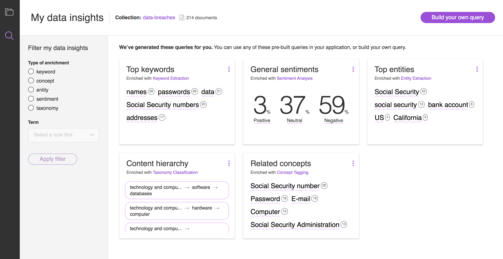

# Bring your own data to Watson Discovery Service

## Overview

* what is Watson Discovery Service?
* cognitive security as a showcase for bring-your-own-data
* you'll find out how we created this dataset and imported it into Watson Discovery Service
* structured data can be queried
* textual data can be enriched, and those enrichments may be queried

The Watson Discovery Service can analyse your data and enrich it, as well as letting you query your data using a cognitive search engine.
[Cognitive Security][cog] demonstrates how you can build an application using the Watson Discovery Service with your own dataset.
You'll find out how to prepare a dataset of your own so that it can be imported and enriched by the Discovery Service.
And you'll find out how to build a search engine using that dataset.

[cog]: https://github.com/nelstrom/discovery-nodejs/tree/byod

## Preparing the dataset

For the [Cognitive Security][cog] demonstration, we used a public dataset that lists cyber security breaches between 2004 and 2017.
The data is available as a [spreadsheet on Google Docs][spreadsheet].
You can download the dataset as Comma-separated values (CSV), by clicking the **File** menu, then **Download as** then selecting the `.csv` file format.


The Discovery Service can import documents in various formats, including PDFs, Word documents, HTML files, and JSON files.
CSV files are not accepted by the Dicovery Service, so we created a [script to convert the data from CSV to JSON format][convert].
The script creates one JSON file for each row in the CSV file.
You can find the resulting JSON files in [the `data` directory][data] of the Cognitive Security repository.
Here's an example JSON file:

```json
{
    "title": "Netflix Twitter account",
    "alternative_name": "",
    "text": "Dec. 'OurMine' hacked Netflix's Twitter account & sent out mocking tweets.",
    "year": "2017",
    "organisation": "web",
    "method_of_leak": "hacked",
    "no_of_records_stolen": 1,
    "data_sensitivity": 1,
    "source_link": "http://www.reuters.com/article/us-netflix-cyber-idUSKBN14A1GR",
    "source_name": "Reuters"
}
```

The structure of the CSV file has been preserved, but some of the field names have been renamed. For example, the `story` field in the CSV file has been renamed as `text` in the JSON file. When you import a JSON document into the Discovery Service, it automatically applies enrichments to the field called `text`. You can apply enrichments to other fields by creating a custom configuration for your data collection, and we'll discuss how to do this later. But for now it makes sense to massage our data so that it can use the default configuration.

The [README file][readme] for the Cognitive Security demo includes detailed instructions on how to create a Watson Discovery Service of your own. After you've created your own collection, uploading the data into the collection couldn't be easier. You just drag the files from your filesystem and drop them onto the uploader widget:


It may take a few minutes for the files to upload, and for the Discovery Service to perform its enrichments on the dataset.

## Querying the dataset

Now that you've got your data into a collection, you can start having fun by running queries against your dataset. The tooling for the Discovery Service provides some utilities to help you with building queries. Press the **Query this collection** button, and you'll see an overview showing some insights into your data.



Now press the **Build your own query** button to bring up a query building form. This interface allows you to compose a query by specifying keywords, filters, and aggregations. To begin with, just leave all fields blank and press the **Run Query** button. In the panel on the right, you should now see the results from running this query.


You can use this interface to explore the data in the collection. Click on the disclosure icons to expand and contract fields. You should find that all each result corresponds to one of the JSON files that you uploaded earlier. All of the original fields from the JSON file are there, and you'll find some additional fields too: `id`, `score`, `extracted_metadata`, and `enriched_text`.

If you drill down into the `enriched_text` field, you'll find fields such as `entities`, `docSentiment`, `taxonomy`, and so on. When your data was imported to the Discovery Service, enrichments were applied to the `text` field, and these fields are the result of that process.

[spreadsheet]: https://docs.google.com/spreadsheets/d/1Je-YUdnhjQJO_13r8iTeRxpU2pBKuV6RVRHoYCgiMfg/edit#gid=322165570
[convert]: https://github.com/nelstrom/extract-json/blob/master/convert.rb
[data]: https://github.com/nelstrom/discovery-nodejs/tree/byod/data/breaches
[readme]: https://github.com/nelstrom/discovery-nodejs/blob/byod/README.md
